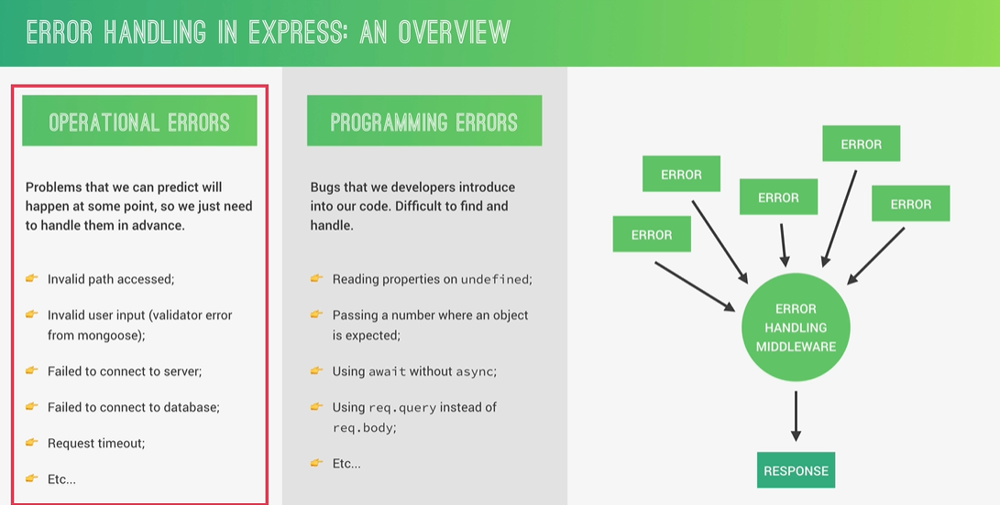
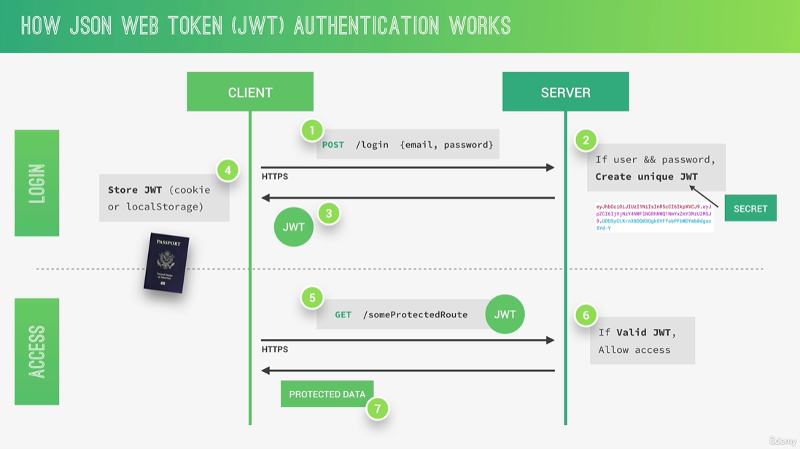

# Section 2: Introduction to Node.js and NPM

---

### 5. What is Node.js and Why Use It?

---

Node JS Pros

- Single-threaded, based on event driven, non-blocking I/O Model
- Perfect fo building fast and scalable data-intensive apps

Use cases:

- API with database behind it
- Data streaming
- Real-time chat application
- Server-side web application

Do not use for:
-Application with heavy server-side processing (CPU-Intensive)

---

###

---

### 8. Rading and Writing files

- Uses Node’s `fs` module to read and write files synchronously
- `readFileSync` loads file content into memory (blocking operation)
- Processes data using a template literal and timestamp
- `writeFileSync` creates/overwrites the output file (also blocking)
- Suitable for simple scripts, not recommended for production due to blocking I/O

```js
const fs = require("fs");
// Simple command to read file
const textIn = fs.readFileSync("./txt/input.txt", "utf-8"); // 2 Arguments, directory and encoding
// console.log(textIn);

const textOut = `This is what we know about the avocado: ${textIn}.\nCreated on ${Date.now()}`;

// Write to a file, 2 arguments - Specify which file and the content
fs.writeFileSync("./txt/output.txt", textOut);

console.log("File written");
```

---

### 10. Reading and Writing Files Asynchronously

---

```js
// Sync vs Async (Node.js execution model)

const fs = require("fs");

// ======================
// SYNC (Blocking)
// ======================

// Reads file synchronously → blocks event loop until finished
const textIn = fs.readFileSync("./txt/input.txt", "utf-8");

// Processes data immediately after read completes
const textOut = `This is what we know about the avocado: ${textIn}.\nCreated on ${Date.now()}`;

// Writes file synchronously → also blocks execution
fs.writeFileSync("./txt/output.txt", textOut);

// This only runs after ALL sync operations above are done
console.log("File written");

// ======================
// ASYNC (Non-blocking)
// ======================

// Starts async file read → delegated to OS / libuv
fs.readFile("./txt/start.txt", "utf-8", (err, data1) => {
  if (err) return console.log(err);

  // Runs later, after sync code has finished
  console.log(data1);

  // Uses result of first file to read another file (dependent async flow)
  fs.readFile(`./txt/${data1}.txt`, "utf-8", (err, data2) => {
    if (err) return console.log(err);

    console.log(data2);

    // Third async operation nested inside → increases complexity
    fs.readFile("./txt/append.txt", "utf-8", (err, data3) => {
      if (err) return console.log(err);

      console.log(data3);
    });
  });
});

// This runs BEFORE any async callbacks above
console.log("will read file>>>");

// ======================
// KEY POINTS
// ======================

// - Sync code blocks → runs fully before anything else
// - Async code is delegated → does not block execution
// - Callbacks run later via the event loop
// - Execution order:
//   1. Sync code
//   2. Async callbacks (when completed)
// - Nested callbacks = "callback hell" → hard to read/maintain
```

---

### 11. Creating a Simple Web Server

---

```js
const http = require("http"); // Core module to create HTTP server

// ======================
// CREATE SERVER
// ======================

// Callback runs on EVERY incoming request
const server = http.createServer((req, res) => {
  // req = incoming request (URL, headers, method, etc.)
  // res = response object used to send data back

  res.end("Hello from the server"); // Ends response and sends data
});

// ======================
// START SERVER
// ======================

// Binds server to IP + port
// 127.0.0.1 = localhost (your machine)
server.listen(8000, "127.0.0.1", () => {
  // Callback runs once when server starts successfully
  console.log("Listening to requests on port 8000");
});
```

---

### 12. Routing

---

```js
const http = require("http");
const url = require("url"); // Used for parsing URL (not fully utilised here)

// ======================
// CREATE SERVER
// ======================

const server = http.createServer((req, res) => {
  // req.url contains path + query string (e.g. /product?id=1)
  const pathName = req.url;

  // ======================
  // ROUTING
  // ======================

  if (pathName === "/" || pathName === "/overview") {
    // Default / overview route
    res.end("This is the overview");
  } else if (pathName === "/product") {
    // Product route (no dynamic handling yet)
    res.end("This is the product");
  } else {
    // ======================
    // ERROR HANDLING
    // ======================

    // Send status code + headers BEFORE response body
    res.writeHead(404, {
      "Content-type": "text/html", // Browser interprets as HTML
      "my-own-header": "hello-world", // Custom header (debug/demo)
    });

    res.end("<h1>Error 404</h1>");
  }
});

// ======================
// START SERVER
// ======================

// Binds to localhost:8000
server.listen(8000, "127.0.0.1", () => {
  console.log("Listening to requests on port 8000");
});

// ======================
// KEY POINTS
// ======================

// - Simple manual routing via req.url (no framework)
// - No parsing → query params ignored (url module unused)
// - res.writeHead sets status + headers (must come before res.end)
// - All logic runs per request (event-driven)
// - Lacks scalability → better handled with routing libs/frameworks (e.g. Express)
```

---

### 13. Building a (Very) Simple API

---

Creates a basic Node.js HTTP server that preloads JSON data once, uses simple manual routing based on req.url, and returns either plain text or the JSON response, but lacks URL parsing, dynamic handling, and proper header consistency.

```js
const http = require("http");
const url = require("url"); // Intended for parsing URL (currently unused)
const fs = require("fs");

// ======================
// LOAD DATA (ONCE)
// ======================

// Synchronous read at startup → blocks only once (acceptable here)
const data = fs.readFileSync(`${__dirname}/dev-data/data.json`, "utf8");

// Parse JSON into JS object (currently unused in routing)
const dataObj = JSON.parse(data);

// ======================
// CREATE SERVER
// ======================

const server = http.createServer((req, res) => {
  // req.url includes path + query (e.g. /api?id=1)
  const pathName = req.url;

  // ======================
  // ROUTING
  // ======================

  if (pathName === "/" || pathName === "/overview") {
    // Basic route → no headers set (defaults to text/plain)
    res.end("This is the overview");
  } else if (pathName === "/product") {
    // Static response → no dynamic product handling yet
    res.end("This is the product");
  } else if (pathName === "/api") {
    // Sends preloaded JSON data (no file read per request → efficient)
    res.writeHead(200, { "Content-type": "application/json" }); // Should be "Content-Type"
    res.end(data); // Sends raw JSON string
  } else {
    // ======================
    // 404 HANDLER
    // ======================

    res.writeHead(404, {
      "Content-type": "text/html", // Should be "Content-Type"
      "my-own-header": "hello-world", // Custom header (demo/debug)
    });

    res.end("<h1>Error 404</h1>");
  }
});

// ======================
// START SERVER
// ======================

// Runs locally on 127.0.0.1:8000
server.listen(8000, "127.0.0.1", () => {
  console.log("Listening to requests on port 8000");
});
```

---

### 14. HTML Templating: Building the Templates

---

```js
// Core Node modules
const http = require("http"); // Creates the web server
const url = require("url"); // Parses URL path + query string
const fs = require("fs"); // Reads local files

// Custom helper function for replacing placeholders in HTML templates
const replaceTemplate = require("./modules/replaceTemplate");

// ======================
// LOAD TEMPLATES + DATA ONCE
// ======================

// These files are read once when the app starts.
// Better than reading them inside the request callback every time.
const tempOverview = fs.readFileSync(
  `${__dirname}/templates/template-overview.html`,
  "utf8",
);

const tempCard = fs.readFileSync(
  `${__dirname}/templates/template-card.html`,
  "utf8",
);

const tempProduct = fs.readFileSync(
  `${__dirname}/templates/template-product.html`,
  "utf8",
);

// Raw JSON string used for the API response
const data = fs.readFileSync(`${__dirname}/dev-data/data.json`, "utf8");

// Parsed JS object used for generating dynamic HTML
const dataObj = JSON.parse(data);

// ======================
// CREATE SERVER
// ======================

const server = http.createServer((req, res) => {
  // Parses URL into pathname and query object
  // Example: /product?id=2
  // pathname = "/product"
  // query = { id: "2" }
  const { query, pathname } = url.parse(req.url, true);

  // ----------------
  // OVERVIEW PAGE
  // ----------------
  if (pathname === "/" || pathname === "/overview") {
    res.writeHead(200, { "Content-Type": "text/html" });

    // Create one HTML card per product
    const cardsHtml = dataObj
      .map((el) => replaceTemplate(tempCard, el))
      .join("");

    // Insert all product cards into the overview template
    const output = tempOverview.replace("", cardsHtml);

    res.end(output);

    // ----------------
    // PRODUCT PAGE
    // ----------------
  } else if (pathname === "/product") {
    res.writeHead(200, { "Content-Type": "text/html" });

    // query.id selects a product from the data array
    // Example: /product?id=0 → first product
    const product = dataObj[query.id];

    // Fill product template with selected product data
    const output = replaceTemplate(tempProduct, product);

    res.end(output);

    // ----------------
    // API ROUTE
    // ----------------
  } else if (pathname === "/api") {
    res.writeHead(200, { "Content-Type": "application/json" });

    // Sends original JSON string directly to the browser/client
    res.end(data);

    // ----------------
    // 404 ROUTE
    // ----------------
  } else {
    res.writeHead(404, {
      "Content-Type": "text/html",
      "my-own-header": "hello-world",
    });

    res.end("<h1>Error 404</h1>");
  }
});

// ======================
// START SERVER
// ======================

// Server listens locally on port 8000
server.listen(8000, "127.0.0.1", () => {
  console.log("Listening to requests on port 8000");
});
```

---

### 19. Types of Packages and Installs

---

Standard dependency that is required to run the project

```bash
npm i slugify
```

dev dependency just for dev production, not critical

```bash
npm i nodemon -save-dev
```

install dependency globally, best to do dev

```bash
npm i nodemon --global
```

change this >

```json
  "scripts": {
    "start": "node index.js",
    "dev": "nodemon index.js"
  },
```

for dev projects

```bash
npm run dev
```

---

# Section 3: Introduction to Back-End Web Development

---

### 25. An Overview of How the Web Works

---

1. request is made to DNS Lookup, then it responds it >

- Protocol: HTTP or HTTPS
- IP Address
- Port Number: Default 443 for HTTPS, 80 for HTTP

2. Connection is made via TCP/IP Socker connection to the server as well as HTTP.
3. Types of HTTP connections: GET, POST, PUT

```json
GET /maps HTTP/1.1 // Start line: HTTP method + request target + HTTP Version
Host: www.google.com // HTTP request headers
User-Agent: Mozilla/5.0
Accept-Language: en-US

<BODY> // Request body (only when sending data to server e.g. POST)
```

4. HTTP Response

```json
HTTP/1.1 200 OK // Start line: HTTP Version + status code + status message

DATE: Fri, 18 Jan 2021 // HTTP response headers
Content-Type: text/html
Transfer-Encoding: chunked

<BODY> // Response body
```

5. Rendering

- index.html is the first to be loaded >
- Scanend for assets: JS, CSS, images >
- Process is repeated for each file

---

# Section 4: How Node.js Works: A Look Behind the Scenes

---

### 30. Node, V8, Libuv and C++

---

Node is built on top of the V8 engine which is built by Google
Also, it's built on libuv which does event loop (threading) and thread pool (File access)

Also, other tools

- http-parser
- c-ares
- OpenSLL
- zlib

---

### 31. Processes, Threads and the Thread Pool

---

NODE.JS Process (Instance of a program in execution on a computer) >
Single Thread (Sequence pf instructions) >

1. Initialize the program
2. Execute top-level code
3. Load/require modules
4. Register event callbacks
5. Start the Event Loop

The Event Loop handles asynchronous callbacks, such as:

```js
setTimeout();
fs.readFile();
server.on("request");
```

It allows Node.js to handle many operations without blocking the main thread.

Some expensive tasks are offloaded to the libuv thread pool, including:

- File system operations
- Cryptography
- Compression
- DNS lookup

---

# 32. The Node.js Event Loop

---

All the application code that is inside callback functions (non-top-level-code)
Node.js is built around callback functions

Event driven architecture

- Events are emitted
- Event loop picks them up
- Callbacks are called

example

Start:

```js
const fs = require("fs");

console.log("1. Top-level code starts");

setTimeout(() => {
  console.log("5. Timers phase: setTimeout callback");
}, 0);

setImmediate(() => {
  console.log("7. Check phase: setImmediate callback");
});

fs.readFile(__filename, "utf8", () => {
  console.log("6. Poll phase: I/O callback from fs.readFile");

  setImmediate(() => {
    console.log("8. Check phase: setImmediate inside I/O");
  });

  setTimeout(() => {
    console.log("9. Timers phase: setTimeout inside I/O");
  }, 0);
});

process.nextTick(() => {
  console.log("3. Microtask: process.nextTick");
});

Promise.resolve().then(() => {
  console.log("4. Microtask: Promise.then");
});

console.log("2. Top-level code ends");
```

---

### 33. The Event Loop in Practice

---

```js
const fs = require("fs");
const crypto = require("crypto");

const start = Date.now();
process.env.UV_THREADPOOL_SIZE = 2;

setTimeout(() => console.log("Timer 1 finished"), 0);
setImmediate(() => console.log("Immediate finished"));

fs.readFile("test-file.txt", () => {
  console.log("I/O Finished");
});

crypto.pbkdf2("password", "salt", 100000, 1024, "sha512", () => {
  console.log(Date.now() - start, "password ");
});
crypto.pbkdf2("password", "salt", 100000, 1024, "sha512", () => {
  console.log(Date.now() - start, "password ");
});
crypto.pbkdf2("password", "salt", 100000, 1024, "sha512", () => {
  console.log(Date.now() - start, "password ");
});
crypto.pbkdf2("password", "salt", 100000, 1024, "sha512", () => {
  console.log(Date.now() - start, "password ");
});

console.log("Hello from the top-level code");
```

1. Top-level code runs first
2. setTimeout waits for timers phase
3. setImmediate waits for check phase
4. fs.readFile runs through I/O / poll phase
5. pbkdf2 uses the libuv thread pool

---

### 34. Events and Event-Driven Architecture

---

Event Emitter → emits event → Listener → executes callback

Doorbell (event) → You hear it (listener) → You open door (callback)

1. Client hits: http://127.0.0.1:8000
1. Server emits: "request" event
1. Listener (server.on) catches it
1. Callback executes
1. Response is sent

```js
const http = require("http");

const server = http.createServer();

server.on("request", (req, res) => {
  console.log("Request received");
  res.end("Response sent");
});

server.listen(8000, "127.0.0.1", () => {
  console.log("Server running on port 8000");
});
```

Another example

```js
const EventEmitter = require("events");

const myEmitter = new EventEmitter();

myEmitter.on("greet", (name) => {
  console.log(`Hello ${name}`);
});

myEmitter.emit("greet", "John");
```

Real world example

```js
const EventEmitter = require("events");
const emitter = new EventEmitter();

function createOrder(order) {
  saveToDB(order);
  emitter.emit("orderCreated", order);
}

// listeners
emitter.on("orderCreated", sendEmail);
emitter.on("orderCreated", updateDashboard);
```

---

### 35. Events in Practice

---

```js
// Import the built-in Node.js 'events' module
// This module provides the EventEmitter class, which allows us to work with events
const EventEmitter = require("events");

// Create a custom class 'Sales' that extends EventEmitter
// This means 'Sales' inherits all event-related functionality (on, emit, etc.)
class Sales extends EventEmitter {
  constructor() {
    // Call the parent class (EventEmitter) constructor
    // This is required when extending classes in JavaScript
    super();
  }
}

// Create an instance of the Sales class
// This object can now emit and listen to events
const myEmitter = new Sales();

// Register an event listener for the "newSale" event
// This listener will run whenever "newSale" is emitted
myEmitter.on("newSale", () => {
  console.log("There was a new sale!");
});

// Register another listener for the same "newSale" event
// Multiple listeners can be attached to the same event
myEmitter.on("newSale", () => {
  console.log("Customer name: Radek");
});

// Register a third listener for "newSale"
// This one accepts a parameter (stock), which will be passed when the event is emitted
myEmitter.on("newSale", (stock) => {
  console.log(`There are now ${stock} items left`);
});

// Emit the "newSale" event
// This triggers ALL listeners registered for "newSale"
// The value '9' is passed as an argument to the listeners that expect parameters
myEmitter.emit("newSale", 9);

// Output will be:
// There was a new sale!
// Customer name: Radek
// There are now 9 items left
```

```js
// Import the built-in Node.js 'http' module
// This module allows us to create HTTP servers and handle requests/responses
const http = require("http");

// Create a new HTTP server instance
// Under the hood, this server is also an EventEmitter
const server = http.createServer();

// Attach a listener to the "request" event
// This event fires every time a client (browser, Postman, etc.) makes a request
server.on("request", (req, res) => {
  console.log("Request received!"); // Log to the console
  res.end("Request received!"); // Send response back to the client and END the response
});

// Attach another listener to the SAME "request" event
// Multiple listeners can exist, and they will run in the order they were registered
server.on("request", (req, res) => {
  console.log("Another request"); // This will also log for every incoming request

  // ⚠️ IMPORTANT:
  // We do NOT call res.end() here.
  // If we tried to send another response, Node.js would throw an error:
  // "Cannot set headers after they are sent to the client"
});

// Attach a listener to the "close" event
// This event is emitted when the server is shut down (e.g., server.close())
server.on("close", () => {
  // ⚠️ NOTE:
  // There is NO 'res' object here because this event is not tied to a specific request
  // Calling res.end() here would cause an error — so we should NOT do that
  console.log("Server closed");
});

// Start the server and make it listen for incoming requests
// - 8000 is the port
// - 127.0.0.1 means localhost (only accessible from this machine)
server.listen(8000, "127.0.0.1", () => {
  console.log("Waiting for requests"); // Runs once the server starts successfully
});
```

---

### 36. Introduction to Streams

---

Streams: Used to process (read and write) data piece by piece (chunks) e.g. YouTube or Netflix.

- Perfect for handling large volumes of data

in Node.JS there are 4 types:

Readable: Streams from which we can read (consume) data.

- http requests
- fs read streams

Important events:

- data
- end

Important functions:

```js
pipe();
read();
```

Writable: Streams from which we can write data.

- http responses
- fs write streams

Important events:

- drain
- finish

Important functions:

```js
write();
end();
```

Duplex: Work in both directions

- net web socket

Transform:

Duxples streams that transform data as it is written or read.

- zlib Gzip creation

---

### 37. Streams in Practice

---

Solution 1: fs.readFile (Load everything into memory)

- fs.readFile loads the entire file into RAM
- Only after loading completes → response is sent

❗ Problems

- Bad for large files
- High memory usage
- Slower for big data (user waits longer)

```js
const fs = require("fs");
const http = require("http");

const server = http.createServer((req, res) => {
  // Reads the entire file into memory before sending it
  fs.readFile("test-file.txt", (err, data) => {
    if (err) {
      res.statusCode = 500;
      return res.end("Error reading file");
    }

    // Send the whole file at once
    res.end(data);
  });
});

server.listen(8000, "127.0.0.1", () => console.log("Listening"));
```

Solution 2: Streams (Manual handling)

- File is read piece by piece (chunks)
- Each chunk is sent immediately to the client

Advantages

- Low memory usage
- Faster for large files
- Starts sending data immediately

❗ Problems

- More verbose

```js
const fs = require("fs");
const http = require("http");

const server = http.createServer((req, res) => {
  // Create a readable stream
  const readable = fs.createReadStream("test-file.txt");

  // Fired when a chunk of data is ready
  readable.on("data", (chunk) => {
    res.write(chunk); // send chunk to client
  });

  // Fired when stream ends
  readable.on("end", () => {
    res.end(); // finish response
  });

  // Handle errors (e.g., file not found)
  readable.on("error", (err) => {
    console.error(err);
    res.statusCode = 500;
    res.end("File not found");
  });
});

server.listen(8000, "127.0.0.1", () => console.log("Listening"));
```

Solution 3: Streams with .pipe() (Best practice)

Automatically handles:

- data flow
- backpressure (very important!)
- ending the response

Only Solution 3 properly handles backpressure.

Backpressure = when the client is slower than the data stream

```js
const fs = require("fs");
const http = require("http");

const server = http.createServer((req, res) => {
  const readable = fs.createReadStream("test-file.txt");

  // Pipe automatically handles data flow from readable → writable
  readable.pipe(res);

  // Still good practice to handle errors
  readable.on("error", (err) => {
    console.error(err);
    res.statusCode = 500;
    res.end("File not found");
  });
});

server.listen(8000, "127.0.0.1", () => console.log("Listening"));
```

---

### 38. How Requiring Modules Really Works

---


---

### 39. Requiring Modules in Practice

---

```js
// console.log(arguments);
// console.log(require("module").wrapper); // '(function (exports, require, module, __filename, __dirname) { ','\n});'

// module.exports
const C = require("./test-module1");
const calc1 = new C();
console.log(calc1.add(2, 5));

// exports
// exports.add = (a, b) => a + b;
const { add, multiply } = require("./test-module2");
console.log(add(2, 10));

// cache

// console.log("Hello from the module");
// module.exports = () => console.log("Log this text 😁");
require("./test-module3")();
require("./test-module3")();
require("./test-module3")();

// Output

// Hello from the module
// Log this text 😁
// Log this text 😁
// Log this text 😁
```

---

# Section 6: Express: Let's Start Building the Natours API!

---

### 50. Setting up Express and Basic Routing

---

```js
const express = require("express");
const app = express();

app.get("/", (req, res) => {
  res.status(200).json({ message: "Hello from the server", app: "Natours" });
});

app.post("/", (req, res) => {
  res.send("You can post to this endpoint");
});

const port = 3000;
app.listen(port, () => {
  console.log(`"App running on port ${port}...`);
});
```

---

### 51. APIs and RESTful API Design

---

```js
const express = require("express"); // Import Express framework (used to build APIs and servers)
const fs = require("fs"); // Import File System module (to read/write files)

const app = express(); // Create an Express application instance

app.use(express.json());
// Middleware: parses incoming request bodies with JSON payloads
// Without this, req.body would be undefined for JSON requests

const tours = JSON.parse(
  fs.readFileSync(`${__dirname}/dev-data/data/tours-simple.json`),
);
// Read tours data from a JSON file synchronously
// __dirname = current directory path
// fs.readFileSync returns raw text → JSON.parse converts it into a JavaScript object (array of tours)

app.get("/api/v1/tours", (req, res) => {
  // Handle GET requests to fetch all tours

  res.status(200).json({
    status: `success`, // Indicates request was successful
    results: tours.length, // Number of tours returned
    data: {
      tours, // Send the tours array as response
    },
  });
});

app.post("/api/v1/tours", (req, res) => {
  // Handle POST requests to create a new tour

  const newId = tours[tours.length - 1].id + 1;
  // Generate a new ID by taking the last tour's ID and adding 1
  // Assumes tours are ordered and IDs are sequential

  const newTour = Object.assign({ id: newId }, req.body);
  // Create a new tour object:
  // - Start with { id: newId }
  // - Merge in properties from req.body (client input)

  tours.push(newTour);
  // Add the new tour to the in-memory array

  fs.writeFile(
    `${__dirname}/dev-data/data/tours-simple.json`,
    JSON.stringify(tours),
    (err) => {
      // Write updated tours array back to file (async)
      // JSON.stringify converts JS object → JSON string

      res.status(201).json({
        status: "success",
        data: {
          tour: newTour, // Return the newly created tour
        },
      });
    },
  );
});

const port = 3000;
app.listen(port, () => {
  // Start server and listen for incoming requests on port 3000
  console.log(`App running on port ${port}...`);
});
```

---

### 54. Responding to URL Parameters

---

```js
// Define a GET endpoint
// Route: /api/v1/tours/:id
// ":id" is a dynamic route parameter
// Example request:
// GET /api/v1/tours/5
app.get("/api/v1/tours/:id", (req, res) => {
  // Extract the id from the URL parameters
  // req.params.id is always a string
  // Number() converts it into a number
  //
  // Example:
  // req.params.id = '5'
  // id = 5
  const id = Number(req.params.id);

  // Search inside the tours array
  // .find() loops through each element
  //
  // "tour" represents the current element
  // during each iteration
  //
  // It returns the FIRST object
  // whose id matches the requested id

  const tour = tours.find((tour) => tour.id === id);

  // If no matching tour is found
  // return a 404 error response
  //
  // !tour means:
  // null, undefined, false, etc.
  if (!tour) {
    return res.status(404).json({
      status: "fail",
      message: "Invalid ID",
    });
  }
  res.status(200).json({
    status: "success",
    data: {
      tour,
    },
  });
});
```

---

### 57. Refactoring Our Routes

---

```js
const createTour = (req, res) => {
  const newId = tours[tours.length - 1].id + 1;
  const newTour = Object.assign({ id: newId }, req.body);

  tours.push(newTour);

  fs.writeFile(
    `${__dirname}/dev-data/data/tours-simple.json`,
    JSON.stringify(tours),
    (err) => {
      res.status(201).json({
        status: "success",
        data: {
          tour: newTour,
        },
      });
    },
  );
};

const updateTour = (req, res) => {
  if (req.params.id * 1 > tours.length) {
    return res.status(404).json({
      status: "fails",
      message: "Invalid ID",
    });
  }
  res.status(200).json({
    status: "success",
    data: {
      tour: `<updated tour here>`,
    },
  });
};

const deleteTour = (req, res) => {
  if (req.params.id * 1 > tours.length) {
    return res.status(404).json({
      status: "fails",
      message: "Invalid ID",
    });
  }
  res.status(204).json({
    status: "success",
    data: null,
  });
};

// app.get('/api/v1/tours/:id', getAllTours);
// app.post('/api/v1/tours', createTour);
// app.patch('/api/v1/tours/:id', getTour);
// app.delete('/api/v1/tours/:id', deleteTour);

app.route("/api/v1/tours").get(getAllTours).post(createTour);

app
  .route("/api/v1/tours/:id")
  .get(getTour)
  .patch(updateTour)
  .delete(deleteTour);

const port = 3000;
app.listen(port, () => {
  console.log(`"App running on port ${port}...`);
});
```

---

### 59. Creating Our Own Middleware

---

```js
// Crucial, must be at the top of the code to be called first
// 1. request, 2. response. 3. middleware
app.use((req, res, next) => {
  console.log("Middleware");
  next(); // Calling middleware. Mandatory
});

app.use((req, res, next) => {
  req.requestTime = new Date().toISOString();
  next();
});
```

---

### 62. Creating and Mounting Multiple Routers

---

```js
const tourRouter = express.Router();
const userRouter = express.Router();

app.use("/api/v1/tours", tourRouter);
app.use("/api/v1/users", userRouter);

tourRouter.route("/").get(getAllTours).post(createTour);
tourRouter.route("/:id").get(getTour).patch(updateTour).delete(deleteTour);

userRouter.route("/").get(getAllUsers).post(createUser);
userRouter.route("/:id").get(getUser).patch(updateUser).delete(deleteUser);
```

---

### 64. Param Middleware

---

```js
// Middleware function that runs whenever an 'id' parameter exists in the route
exports.checkID = (req, res, next, val) => {
  // req.params.id comes from the URL and is a string
  // '* 1' converts it into a number
  // Check if the ID is greater than the number of tours available
  if (req.params.id * 1 > tours.length) {
    // If invalid, send a 404 response and stop execution
    return res.status(404).json({
      status: "fails",
      message: "Invalid ID",
    });
  }

  // If the ID is valid, move to the next middleware/controller
  next();
};
```

```js
// Register param middleware for any route containing ':id'
// Example: GET /tours/5
// Express automatically calls checkID before the route handler
router.param("id", tourController.checkID);
```

---

# Section 7: Introduction to MongoDB

---

### 74. [OPTIONAL] Creating a Local Database

---

Switch between databases

```bash
use # db-name
```

- Create a record

```bash
db.tours.insertOne({name:"The Forest Hiker", price: 297, rating:4.7})
{
  acknowledged: true,
  insertedId: ObjectId('69fd116f16fce36ff2abc114')
}
```

```bash
db.tours.insertOne({name:"The Forest Hiker", price: 297, rating:4.7})
{
  acknowledged: true,
  insertedId: ObjectId('69fd116f16fce36ff2abc114')
}

```

show record

```bash

db.tours.find()
[
  {
    _id: ObjectId('69fd116f16fce36ff2abc114'),
    name: 'The Forest Hiker',
    price: 297,
    rating: 4.7
  }
]

```

show all databases

```bash
show dbs
```

show existing collections within the database

```bash
show collections
```

---

# 75. [OPTIONAL] CRUD: Creating Documents

---

```bash
db.tours.insertMany([{ name: "The Sea Explorer", price: 497, raing: 4.8}, {name:"The Snow Adventurer", price:997, rating: 4.9, difficulty: "easy"}])

```

---

# 76. [OPTIONAL] CRUD: Querying (Reading) Documents

---

```bash
db.tours.find({name: "The Forest Hiker"})
```

```bash
db.tours.find({difficulty: "easy"})

```

"$" refers to special operator e.g. lte - less than, gte - greater than

```bash
db.tours.find({ price : {$lte: 500}, rating: {$gte: 4} })
```

OR operator

```bash
db.tours.find({ $or :[ {price : {$lte: 500}}, {rating : {$gte : 4}} ]})
```

or operator and showing less stuff e.g.

```bash
db.tours.find({ $or : [ { price : {$lte : 500}}, {rating : {gte : 4}} ]}, {name:1})
```

---

# 77. [OPTIONAL] CRUD: Updating Documents

---

```bash
db.tours.updateOne({name: "The Snow Adventurer"}, {$set : {price : 597} })
{
  acknowledged: true,
  insertedId: null,
  matchedCount: 1,
  modifiedCount: 1,
  upsertedCount: 0
}
```

---

# 78. [OPTIONAL] CRUD: Deleting Documents

---

```bash
db.tours.deleteMany({ rating : {$lt : 4.8}})
{ acknowledged: true, deletedCount: 1 }
natours-test>
```

---

# Section 8: Using MongoDB with Mongoose

---

### 85. Creating a Simple Tour Model

---

```js
// Import Mongoose, an ODM (Object Data Modeling) library for MongoDB.
// Mongoose makes it easier to define schemas, validate data,
// and interact with MongoDB using JavaScript objects.
const mongoose = require("mongoose");

// Import dotenv to load environment variables from config.env
const dotenv = require("dotenv");

// Load variables like DATABASE, DATABASE_PASSWORD, PORT into process.env
dotenv.config({ path: "./config.env" });

// Import the Express application
const app = require("./app");

// process.env.DATABASE likely contains a MongoDB connection string like:
// mongodb+srv://username:<PASSWORD>@cluster.mongodb.net/tours
//
// Replace the placeholder <PASSWORD> with the actual password
// from the environment variable DATABASE_PASSWORD.
const DB = process.env.DATABASE.replace(
  "<PASSWORD>",
  process.env.DATABASE_PASSWORD,
);

// Connect Mongoose to MongoDB
//
// mongoose.connect():
// - Establishes a connection between your Node.js app and MongoDB
// - Returns a Promise
//
// DB = MongoDB connection URI
mongoose
  .connect(DB, {
    // These options were needed in older Mongoose versions
    // but are deprecated/ignored in modern versions.
    // useNewUrlParser: true,
    // Uses the new MongoDB connection string parser
    // useCreateIndex: true,
    // Uses createIndex() instead of deprecated ensureIndex()
    // useFindAndModify: true,
    // Controls whether findOneAndUpdate() uses native MongoDB methods
  })

  // Runs if connection succeeds
  .then(() => {
    console.log("Connected to the DB!");
  });

// Define a Mongoose Schema
//
// A Schema describes the structure of documents inside a MongoDB collection.
//
// MongoDB itself is schema-less, meaning it allows flexible document structure.
// Mongoose adds schema enforcement and validation on top of MongoDB.
const tourSchema = new mongoose.Schema({
  // Field: name
  name: {
    type: String, // Must be a string

    // Validation: this field is required
    // If missing, Mongoose throws:
    // "A tour must have a name"
    required: [true, "A tour must have a name"],

    // Ensures MongoDB creates a unique index for this field
    // Prevents duplicate tour names
    unique: true,
  },

  // Field: rating
  rating: {
    type: Number, // Must be a number

    // If no rating is provided, default to 4.5
    default: 4.5,
  },

  // Field: price
  price: {
    type: Number,

    // Required validation
    required: [true, "A tour must have a price"],
  },
});

// Create a Mongoose Model
//
// Syntax:
// mongoose.model('ModelName', schema)
//
// This creates a Model class based on the schema.
//
// The model allows database operations like:
// Tour.find()
// Tour.create()
// Tour.save()
// Tour.findById()
// Tour.updateOne()
//
// 'Tour' becomes the collection name 'tours' in MongoDB
// (Mongoose pluralizes and lowercases model names automatically)
const Tour = mongoose.model("Tour", tourSchema);

// Set application port
//
// Use PORT from environment variables if available,
// otherwise default to 8001
const port = process.env.PORT || 8001;

// Start Express server
app.listen(port, () => {
  console.log(`App running on port ${port}...`);
});
```

---

### 86. Creating Documents and Testing the Model

---

```js
const testTour = new Tour({
  name: "The Parl Camper",
  rating: 4.7,
  price: 497,
});

testTour
  .save()
  .then((doc) => {
    console.log(doc);
  })
  .catch((err) => {
    console.log(err);
  });
```

---

### 95. Making the API Better: Filtering

```js
// BUILD QUERY
// 1) Filtering
const queryObj = { ...req.query };
const excludedFields = ["page", "sort", "limit", "fields"];
excludedFields.forEach((el) => delete queryObj[el]);

// Build a Mongoose query using the remaining URL query parameters as filters
// Example: ?duration=5&difficulty=easy
// becomes: Tour.find({ duration: '5', difficulty: 'easy' })
const query = Tour.find(queryObj);

// EXECUTE QUERY
const tours = await query;

console.log(req.query);
// SEND RESPONSE
res.status(200).json({
  status: "success",
  results: tours.length,
  data: {
    tours,
  },
});
```

---

### 96. Sorting

---

```js
// 2) Sorting
// http://localhost:8000/api/v1/tours?sort=price,ratingsAverage

if (req.query.sort) {
  const sortBy = req.query.sort.split(",").join(" ");
  // console.log(sortBy);
  query = query.sort(sortBy);
  // sort("price rattingsAverage")
} else {
  query = query.sort("-createdAt");
}
```

---

### 99. Limiting fields

---

```js
// 3) Field limiting

// http://localhost:8000/api/v1/tours?fields=name,duration,difficulty,price
if (req.query.fields) {
  const fields = req.query.fields.split(",").join(" ");
  query = query.select(fields); // include
} else {
  // http://localhost:8000/api/v1/tours?fields=-name
  query = query.select("-__v"); // exclude
}
```

---

### 101. Refactoring pipelines

---

```js
class APIFeatures {
  constructor(query, queryString) {
    ((this.query = query), (this.queryString = queryString));
  }
  filter() {
    const queryObj = { ...this.queryString };
    const excludedFields = ["page", "sort", "limit", "fields"];
    excludedFields.forEach((el) => delete queryObj[el]);

    let queryStr = JSON.stringify(queryObj);
    queryStr = queryStr.replace(/\b(gte|gt|lte|lt)\b/g, (match) => `$${match}`);
    this.query = this.query.find(JSON.parse(queryStr));

    return this;
  }

  sort() {
    if (this.queryString.sort) {
      const sortBy = this.queryString.sort.split(",").join(" ");
      // console.log(sortBy);
      this.query = this.query.sort(sortBy);
      // sort("price rattingsAverage")
    } else {
      this.query = this.query.sort("-createdAt");
    }
    return this;
  }

  limitFields() {
    if (this.queryString.fields) {
      const fields = this.queryString.fields.split(",").join(" ");
      this.query = this.query.select(fields); // include
    } else {
      // http://localhost:8000/api/v1/tours?fields=-name
      this.query = this.query.select("-__v"); // exclude
    }

    return this;
  }

  paginate() {
    const page = this.queryString.page * 1 || 1;
    const limit = this.queryString.limit * 1 || 100;
    const skip = (page - 1) * limit;

    // http://localhost:8000/api/v1/tours?page=2&limit=3
    this.query = this.query.skip(skip).limit(limit);
    return this;
  }
}
```

```js
const getAllTours = async (req, res) => {
  try {
    // EXECUTE QUERY
    const features = new APIFeatures(Tour.find(), req.query)
      .filter()
      .sort()
      .limitFields()
      .paginate();
    const tours = await features.query;
    // SEND RESPONSE
    res.status(200).json({
      status: "success",
      results: tours.length,
      data: {
        tours,
      },
    });
  } catch (err) {
    res.status(500).json({
      status: "fail",
      message: err.message,
    });
  }
};
```

---

### 102. Aggregation pipeline: Matching and grouping

---

```js
getTourStats = async (req, res) => {
  try {
    const stats = await Tour.aggregate([
      { $match: { ratingsAverage: { $gte: 4.5 } } }, // Only include highly rated tours
      {
        $group: {
          _id: `$difficulty`, // Group tours by difficulty
          numTours: { $sum: 1 }, // Count tours in each group
          numRatings: { $sum: `$ratingsAverage` }, // Sum all ratings
          avgRating: { $avg: `$ratingsAverage` }, // Calculate the average rating
          avgPrice: { $avg: `$price` }, // Calculate the average price
          minPrice: { $min: `$price` }, // Find the lowest price
          maxPrice: { $max: `$price` }, // Find the highest price
        },
      },
      { $sort: { avgPrice: 1 } }, // Sort by average price (lowest first)
    ]);

    res.status(200).json({
      status: "success", // Indicate the request succeeded
      data: {
        stats, // Return the calculated statistics
      },
    });
  } catch (err) {
    res.status(400).json({
      status: "fail", // Indicate the request failed
      message: err.message, // Return the error message
    });
  }
};
```

---

### 103. Aggregation Pipeline: Unwinding and Projecting

---

```js
router.route(`/monthly-plan/:year`).get(tourController.getMonthlyPlan);
```

```js
getMonthlyPlan = async (req, res) => {
  try {
    const year = req.params.year * 1; // Convert the year parameter to a number

    const plan = await Tour.aggregate([
      {
        $unwind: `$startDates`, // Split the startDates array into separate documents
      },
      {
        $match: {
          startDates: {
            $gte: new Date(`${year}-01-01`), // Keep dates from the start of the year
            $lte: new Date(`${year}-12-31`), // Keep dates until the end of the year
          },
        },
      },
      {
        $group: {
          _id: { $month: `$startDates` }, // Group by month
          numToursStarts: { $sum: 1 }, // Count tour starts
          tours: { $push: `$name` }, // Collect tour names
        },
      },
      { $addFields: { month: `$_id` } }, // Add a month field
      { $project: { _id: 0 } }, // Remove the _id field
      { $sort: { numToursStarts: -1 } }, // Sort by number of tour starts
      { $limit: 12 }, // Return up to 12 months
    ]);

    res.status(200).json({
      status: "success", // Indicate a successful request
      data: {
        plan, // Return the monthly plan
      },
    });
  } catch (err) {
    res.status(400).json({
      status: "fail", // Indicate the request failed
      message: err.message, // Return the error message
    });
  }
};
```

---

### 105. Document Middleware

---

```js
// Document middleware: Runs before save() and create()
tourSchema.pre("save", function () {
  this.slug = slugify(this.name, { lower: true }); // Generate a URL-friendly slug from the tour name
});

tourSchema.pre("save", function () {
  console.log("Will save document..."); // Log a message before the document is saved
});

tourSchema.post("save", function (doc) {
  console.log(doc); // Log the saved document after it has been stored
});
```

---

### 106. Query Middleware

---

```js
// Query middleware: Runs before any query whose name starts with "find"
// (e.g. find(), findOne(), findById(), findOneAndUpdate(), findOneAndDelete())
tourSchema.pre(/^find/, function () {
  this.find({ secretTour: { $ne: true } }); // Exclude secret tours from the query results
  this.start = Date.now(); // Save the current time to measure query duration
});

// Query middleware: Runs after any "find" query completes
tourSchema.post(/^find/, function (docs) {
  console.log(`Query took ${Date.now() - this.start} milliseconds!`); // Log how long the query took
  console.log(docs); // Log the documents returned by the query
});
```

---

### 107. Aggregation Middleware

---

```js
// Aggregation Middleware

tourSchema.pre(`aggregate`, function () {
  this.pipeline().unshift({ $match: { secretTour: { $ne: true } } });
  console.log(this);
});
```

---

# Section 9: Error Handling with Express

---

### 111. Debugging Node.js with ndb

---

```bash
npm i ndb --global
```

To run > npm run debug

```json
  "scripts": {

    "debug": "ndb server.js"
  },
```

---

### 112. Handling Unhandled Routes

---

```js
app.all("/{*splat}", (req, res, next) => {
  // Just * in newer versions
  res.status(404).json({
    status: "fail",
    message: `Can't find ${req.originalUrl} on this server`,
  });
});
```

---

### 113. An Overview of Error Handling

---



---

### 115. Better Errors and Refactoring

---

```js
class AppError extends Error {
  /**
   * Creates an operational application error.
   *
   * @param {string} message - Human-readable error message.
   * @param {number} statusCode - HTTP status code associated with the error.
   */
  constructor(message, statusCode) {
    // Initialize the built-in Error class and set `this.message`.
    super(message);

    // Store the HTTP status code so error-handling middleware can use it.
    this.statusCode = statusCode;

    // Classify 4xx errors as client failures and everything else as server errors.
    this.status = `${statusCode}`.startsWith("4") ? "fail" : "err";

    // Mark this as an expected, operational error rather than a programming bug.
    this.isOperational = true;

    // Remove this constructor from the stack trace, making debugging output cleaner.
    // `captureStackTrace` is primarily available in V8-based runtimes such as Node.js.
    Error.captureStackTrace(this, this.constructor);
  }
}

module.exports = AppError;
```

```js
/**
 * Global Express error-handling middleware.
 *
 * Express recognizes this as an error handler because it accepts
 * four parameters: (err, req, res, next).
 */
module.exports = (err, req, res, next) => {
  // Use the error's status code if it exists; otherwise default to 500
  // (Internal Server Error).
  err.statusCode = err.statusCode || 500;

  // Use the error's status if it exists; otherwise assume it's
  // an unexpected server error.
  err.status = err.status || "error";

  // Send a JSON response containing the status and error message.
  res.status(err.statusCode).json({
    status: err.status,
    message: err.message,
  });
};
```

---

# Section 10: Authentication, Authorization and Security

---

### 127. Managing Passwords

---

```js
const mongoose = require("mongoose");
const validator = require("validator");
const bcrypt = require("bcryptjs");

/*
|--------------------------------------------------------------------------
| USER SCHEMA
|--------------------------------------------------------------------------
| Defines the structure and validation rules for user documents.
|
| Fields:
| - name
| - email
| - photo
| - password
| - passwordConfirm (used only during signup validation)
|
*/
const userSchema = new mongoose.Schema({
  // User's full name (required)
  name: {
    type: String,
    required: [true, "Please tell us your name"],
  },

  /*
  | User's email address.
  | - Must be unique.
  | - Automatically converted to lowercase.
  | - Validated using validator.isEmail().
  */
  email: {
    type: String,
    required: [true, "Please provide your email"],
    unique: true,
    lowercase: true,
    validate: [validator.isEmail, "Please provide a valid email"],
  },

  // Stores the profile photo filename or URL.
  photo: String,

  /*
  | User password.
  | - Minimum 8 characters.
  | - Stored as a hashed value before saving.
  */
  password: {
    type: String,
    required: [true, "Please provide a password"],
    minlength: 8,
  },

  /*
  | Confirms the password during signup.
  | Must match the password field.
  | This field is removed before saving to the database.
  | Works only with create() and save().
  */
  passwordConfirm: {
    type: String,
    required: [true, "Please confirm your password"],
    validate: {
      validator: function (el) {
        return el === this.password;
      },
      message: "Passwords are not the same",
    },
  },
});

/*
|--------------------------------------------------------------------------
| PRE-SAVE MIDDLEWARE
|--------------------------------------------------------------------------
| Runs before a document is saved.
|
| - Hashes the password using bcrypt.
| - Removes passwordConfirm since it isn't needed in the database.
| - Skips hashing if the password wasn't modified.
|
*/
userSchema.pre("save", async function () {
  if (!this.isModified("password")) return;

  this.password = await bcrypt.hash(this.password, 12);
  this.passwordConfirm = undefined;
});

// Create the User model (maps to the "users" collection in MongoDB).
const User = mongoose.model("User", userSchema);

// Export the model for use in other files.
module.exports = User;
```

---

### 128. How Authentication with JWT Works

---



# How JSON Web Token (JWT) Authentication Works

## Login Flow

### 1. Client → Server

**Request**

```http
POST /login
```

**Body**

```json
{
  "email": "user@example.com",
  "password": "your-password"
}
```

Sent over **HTTPS**.

---

### 2. Server

- Verify the user's email and password.
- If the credentials are valid:
  - Create a unique JWT.
  - Sign it using a **secret key**.

```
JWT + SECRET → Signed Token
```

---

### 3. Server → Client

Return the generated JWT.

```
JWT
```

---

### 4. Client

Store the JWT for future requests.

Common storage options:

- HTTP-only Cookie (recommended)
- Local Storage

---

## Accessing Protected Resources

### 5. Client → Server

Request a protected route while sending the JWT.

```http
GET /someProtectedRoute
```

Example header:

```http
Authorization: Bearer <JWT>
```

Sent over **HTTPS**.

---

### 6. Server

Validate the JWT.

- If the token is valid:
  - Allow access.
- Otherwise:
  - Return **401 Unauthorized**.

---

### 7. Server → Client

Return the requested protected data.

```
Protected Data
```

---

## Overall Flow

```text
Client
  │
  ├── POST /login (email, password)
  ▼
Server
  │
  ├── Verify credentials
  ├── Create JWT
  ▼
Client
  │
  ├── Store JWT
  │
  ├── GET /someProtectedRoute
  ├── Authorization: Bearer <JWT>
  ▼
Server
  │
  ├── Verify JWT
  │
  ├── Valid? ── Yes ──► Return Protected Data
  │
  └── No ──► 401 Unauthorized
```

---
